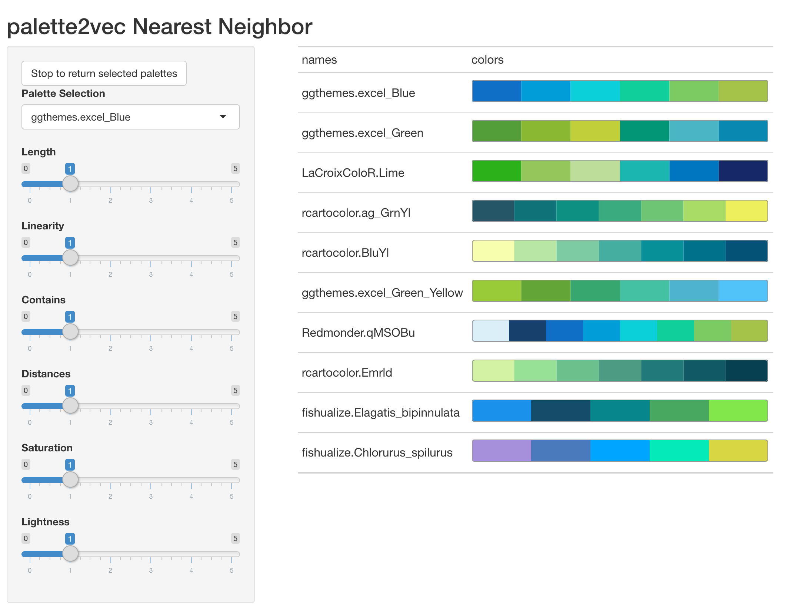

<!-- README.md is generated from README.Rmd. Please edit that file -->

```{r, include = FALSE}
knitr::opts_chunk$set(
  collapse = TRUE,
  comment = "#>",
  fig.path = "man/figures/README-",
  out.width = "100%"
)
```

# palette2vec 

<!-- badges: start -->
[](https://github.com/EmilHvitfeldt/palette2vec/actions)
[](https://www.tidyverse.org/lifecycle/#experimental)
<!-- badges: end -->

The goal of palette2vec is to help you explore color palettes more easily in R.

## Installation

You can install the development version from [GitHub](http://github.com/) with:

``` r
# install.packages("devtools")
devtools::install_github("EmilHvitfeldt/palette2vec")
```

## Examples

The main function in this package is `palette2vec()` it takes a named list of color palettes and returns a tibble of metrics for each palettes. 

```{r}
library(palette2vec)

palette2vec(color_hex_palettes)
```

All the discrete palettes from [paletteer](https://emilhvitfeldt.github.io/paletteer/) have been added to this package as the `paletteer_palettes()` function

```{r}
head(paletteer_palettes())
```

Which can be passed to `palette2vec()` as well.

```{r}
palette2vec(paletteer_palettes())
```

# Interactivity

palette2vec contains 2 functions to allow you to interactively explore color palettes.

## Nearest neighbor palettes

The first function is `nn_palettes()`, this function will take a named list of color palettes and launch a shiny application. This shiny app contains a dropdown menu and some sliders. Use the dropdown menu to select a palette, and the table on the right will show said palette and its closest neighbors in palette2vec space. The sliders can be used to assign weights to different metrics.

```{r, eval=FALSE}
nearest_palettes <- nn_palettes(paletteer_palettes())
```



You can return the showcased palettes by clicking the button at the upper left corner.

```{r, eval=FALSE}
nearest_palettes
```

```{r, echo=FALSE}
list(
  ggthemes.excel_Blue = 
    c("#0F6FC6", "#009DD9", "#0BD0D9", "#10CF9B", "#7CCA62", "#A5C249"), 
  ggthemes.excel_Green = 
    c("#549E39", "#8AB833", "#C0CF3A", "#029676", "#4AB5C4", "#0989B1"), 
  LaCroixColoR.Lime = 
    c("#2CB11B", "#95C65C", "#BDDE9B", "#1BB6AF", "#0076C0", "#172869"), 
  rcartocolor.ag_GrnYl = 
    c("#245668", "#0F7279", "#0D8F81", "#39AB7E", "#6EC574", "#A9DC67", 
      "#EDEF5D"), 
  rcartocolor.BluYl = 
    c("#f7feae", "#b7e6a5", "#7ccba2", "#46aea0", "#089099", "#00718b", 
      "#045275"), 
  ggthemes.excel_Green_Yellow = 
    c("#99CB38", "#63A537", "#37A76F", "#44C1A3", "#4EB3CF", "#51C3F9"), 
  Redmonder.qMSOBu = 
    c("#DBEFF9", "#17406D", "#0F6FC6", "#009DD9", "#0BD0D9", "#10CF9B", 
      "#7CCA62", "#A5C249"), 
  rcartocolor.Emrld = 
    c("#d3f2a3", "#97e196", "#6cc08b", "#4c9b82", "#217a79", "#105965", 
      "#074050"), 
  fishualize.Elagatis_bipinnulata = 
    c("#1a91eb", "#144c69", "#07868c", "#49a85f", "#81e74a"), 
  fishualize.Chlorurus_spilurus = 
    c("#a790db", "#4a79bc", "#00a5ff", "#04eab8", "#d8d643")
)
```

## UMAP projection

The second function is `umap_embedding()`, this function will take a named list of color palettes and launch a shiny application. You will have sliders this time around which performs the same operations as they do in `nn_palettes()`, but this time you have a `plotly()` chart where each point is a color palette projected to 2 dimensions using UMAP from palette2vec space. You can selection different regions and the corresponding palettes will be showcased

```{r, eval=FALSE}
umap_selected <- umap_embedding(paletteer_palettes())
```


You can return the selected palettes by clicking the button at the upper left corner.

```{r, eval=FALSE}
umap_selected
```

```{r, echo=FALSE}
list(
  colorBlindness.Blue2DarkRed12Steps = 
    c("#290AD8", "#264DFF", "#3FA0FF", "#72D9FF", "#AAF7FF", "#E0FFFF", 
      "#FFFFBF", "#FFE099", "#FFAD72", "#F76D5E", "#D82632", "#A50021"), 
  colorBlindness.Blue2DarkRed18Steps = 
    c("#2400D8", "#181CF7", "#2857FF", "#3D87FF", "#56B0FF", "#75D3FF", 
      "#99EAFF", "#BCF9FF", "#EAFFFF", "#FFFFEA", "#FFF1BC", "#FFD699", 
      "#FFAC75", "#FF7856", "#FF3D3D", "#F72735", "#D8152F", "#A50021"), 
  colorBlindness.Blue2Orange10Steps = 
    c("#0054FF", "#3299FF", "#65CCFF", "#99EDFF", "#CCFFFF", "#FFFFCC", 
      "#FFEE99", "#FFCC65", "#FF9932", "#FF5500"), 
  colorBlindness.Blue2Orange12Steps = 
    c("#002AFF", "#1965FF", "#3299FF", "#65CCFF", "#99EDFF", "#CCFFFF", 
      "#FFFFCC", "#FFEE99", "#FFCC65", "#FF9932", "#FF6619", "#FF2A00"), 
  colorBlindness.Blue2Orange8Steps = 
    c("#007FFF", "#4CC3FF", "#99EDFF", "#CCFFFF", "#FFFFCC", "#FFEE99", 
      "#FFC34C", "#FF7F00"), 
  colorBlindness.Blue2OrangeRed14Steps = 
    c("#075AFF", "#3276FF", "#5990FF", "#8CB2FF", "#BFD4FF", "#E5EEFF", 
      "#F7F9FF", "#FFFFCC", "#FFFF99", "#FFFF00", "#FFCC00", "#FF9900", 
      "#FF6600", "#FF0000")
)
```

## Code of Conduct

Please note that the palette2vec project is released with a [Contributor Code of Conduct](https://contributor-covenant.org/version/2/0/CODE_OF_CONDUCT.html). By contributing to this project, you agree to abide by its terms.
