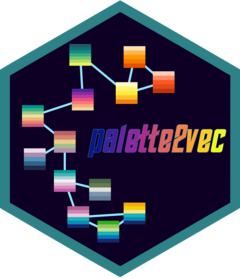

<!-- README.md is generated from README.Rmd. Please edit that file -->

# palette2vec 

<!-- badges: start -->

<!-- badges: end -->

The goal of palette2vec is to help you explore color palettes more
easily in R.

## Installation

You can install the development version from
[GitHub](http://github.com/) with:

``` r
# install.packages("devtools")
devtools::install_github("EmilHvitfeldt/palette2vec")
```

## Examples

The main function in this package is `palette2vec()` it takes a named
list of color palettes and returns a tibble of metrics for each
palettes.

``` r
library(palette2vec)

palette2vec(color_hex_palettes)
#> # A tibble: 993 x 29
#>    name  n_cols linear linear_split min_dist max_dist mean_dist min_saturation
#>    <chr>  <int>  <dbl>        <dbl>    <dbl>    <dbl>     <dbl>          <dbl>
#>  1 Ann …      5  0.935        0.920     9.42     48.0      25.5           0   
#>  2 i he…      5  1.00         1         3.92     26.6      13.6          50.7 
#>  3 the …      5  1.00         1         5.54     30.5      15.1          15.3 
#>  4 my m…      5  1.00         1         4.72     21.3      10.6          45.4 
#>  5 hty        5  0.845        0.949     3.99     38.4      17.3           0   
#>  6 my h…      5  1.00         1         6.19     36.4      21.1          11.0 
#>  7 my s…      5  1.00         1         6.47     28.6      14.5          28.5 
#>  8 a w …      5  1.00         1         4.50     21.1      10.5          22.1 
#>  9 you …      5  1.00         1         5.38     34.4      17.6           8.66
#> 10 just…      5  1.00         1         6.01     33.9      18.3          11.2 
#> # … with 983 more rows, and 21 more variables: max_saturation <dbl>,
#> #   mean_saturation <dbl>, min_lightness <dbl>, max_lightness <dbl>,
#> #   mean_lightness <dbl>, contains_min_red <dbl>, contains_min_orange <dbl>,
#> #   contains_min_yellow <dbl>, contains_min_green <dbl>,
#> #   contains_min_turqouise <dbl>, contains_min_blue <dbl>,
#> #   contains_min_purple <dbl>, contains_min_pink <dbl>, contains_all_red <dbl>,
#> #   contains_all_orange <dbl>, contains_all_yellow <dbl>,
#> #   contains_all_green <dbl>, contains_all_turqouise <dbl>,
#> #   contains_all_blue <dbl>, contains_all_purple <dbl>, contains_all_pink <dbl>
```

All the discrete palettes from
[paletteer](https://emilhvitfeldt.github.io/paletteer/) have been added
to this package as the `paletteer_palettes()` function

``` r
head(paletteer_palettes())
#> $awtools.a_palette
#> [1] "#2A363B" "#019875" "#99B898" "#FECEA8" "#FF847C" "#E84A5F" "#C0392B"
#> [8] "#96281B"
#> 
#> $awtools.ppalette
#> [1] "#F7DC05" "#3d98d3" "#EC0B88" "#5e35b1" "#f9791e" "#3dd378" "#c6c6c6"
#> [8] "#444444"
#> 
#> $awtools.bpalette
#>  [1] "#c62828" "#f44336" "#9c27b0" "#673ab7" "#3f51b5" "#2196f3" "#29b6f6"
#>  [8] "#006064" "#009688" "#4caf50" "#8bc34a" "#ffeb3b" "#ff9800" "#795548"
#> [15] "#9e9e9e" "#607d8b"
#> 
#> $awtools.gpalette
#> [1] "#d6d6d6" "#adadad" "#707070" "#333333"
#> 
#> $awtools.mpalette
#> [1] "#017a4a" "#FFCE4E" "#3d98d3" "#ff363c" "#7559a2" "#794924" "#8cdb5e"
#> [8] "#d6d6d6" "#fb8c00"
#> 
#> $awtools.spalette
#> [1] "#9F248F" "#FFCE4E" "#017a4a" "#f9791e" "#244579" "#c6242d"
```

Which can be passed to `palette2vec()` as well.

``` r
palette2vec(paletteer_palettes())
#> # A tibble: 1,711 x 29
#>    name  n_cols linear linear_split min_dist max_dist mean_dist min_saturation
#>    <chr>  <int>  <dbl>        <dbl>    <dbl>    <dbl>     <dbl>          <dbl>
#>  1 awto…      8  0.963        0.975     9.52     67.4      40.5           16.8
#>  2 awto…      8  0.688        0.749    25.9      89.8      47.6            0  
#>  3 awto…     16  0.840        0.921    10.3      87.2      42.2            0  
#>  4 awto…      4  0.998        1        10.5      62.4      32.3            0  
#>  5 awto…      9  0.814        0.962    20.6      72.8      43.5            0  
#>  6 awto…      6  0.674        1        27.4      73.3      47.8           54.1
#>  7 base…     10  0.857        0.889    15.6      77.0      41.1           20.9
#>  8 base…     10  0.820        0.827    13.4      83.9      45.3           28.0
#>  9 base…     10  0.791        0.736    11.8      79.4      43.9           35.3
#> 10 base…     10  0.823        0.975    15.9      88.8      46.4           41.5
#> # … with 1,701 more rows, and 21 more variables: max_saturation <dbl>,
#> #   mean_saturation <dbl>, min_lightness <dbl>, max_lightness <dbl>,
#> #   mean_lightness <dbl>, contains_min_red <dbl>, contains_min_orange <dbl>,
#> #   contains_min_yellow <dbl>, contains_min_green <dbl>,
#> #   contains_min_turqouise <dbl>, contains_min_blue <dbl>,
#> #   contains_min_purple <dbl>, contains_min_pink <dbl>, contains_all_red <dbl>,
#> #   contains_all_orange <dbl>, contains_all_yellow <dbl>,
#> #   contains_all_green <dbl>, contains_all_turqouise <dbl>,
#> #   contains_all_blue <dbl>, contains_all_purple <dbl>, contains_all_pink <dbl>
```

# Interactivity

palette2vec contains 2 functions to allow you to interactively explore
color palettes.

## Nearest neighbor palettes

The first function is `nn_palettes()`, this function will take a named
list of color palettes and launch a shiny application. This shiny app
contains a dropdown menu and some sliders. Use the dropdown menu to
select a palette, and the table on the right will show said palette and
its closest neighbors in palette2vec space. The sliders can be used to
assign weights to different metrics.

``` r
nearest_palettes <- nn_palettes(paletteer_palettes())
```


You can return the showcased palettes by clicking the button at the
upper left corner.

``` r
nearest_palettes
```

    #> $ggthemes.excel_Blue
    #> [1] "#0F6FC6" "#009DD9" "#0BD0D9" "#10CF9B" "#7CCA62" "#A5C249"
    #> 
    #> $ggthemes.excel_Green
    #> [1] "#549E39" "#8AB833" "#C0CF3A" "#029676" "#4AB5C4" "#0989B1"
    #> 
    #> $LaCroixColoR.Lime
    #> [1] "#2CB11B" "#95C65C" "#BDDE9B" "#1BB6AF" "#0076C0" "#172869"
    #> 
    #> $rcartocolor.ag_GrnYl
    #> [1] "#245668" "#0F7279" "#0D8F81" "#39AB7E" "#6EC574" "#A9DC67" "#EDEF5D"
    #> 
    #> $rcartocolor.BluYl
    #> [1] "#f7feae" "#b7e6a5" "#7ccba2" "#46aea0" "#089099" "#00718b" "#045275"
    #> 
    #> $ggthemes.excel_Green_Yellow
    #> [1] "#99CB38" "#63A537" "#37A76F" "#44C1A3" "#4EB3CF" "#51C3F9"
    #> 
    #> $Redmonder.qMSOBu
    #> [1] "#DBEFF9" "#17406D" "#0F6FC6" "#009DD9" "#0BD0D9" "#10CF9B" "#7CCA62"
    #> [8] "#A5C249"
    #> 
    #> $rcartocolor.Emrld
    #> [1] "#d3f2a3" "#97e196" "#6cc08b" "#4c9b82" "#217a79" "#105965" "#074050"
    #> 
    #> $fishualize.Elagatis_bipinnulata
    #> [1] "#1a91eb" "#144c69" "#07868c" "#49a85f" "#81e74a"
    #> 
    #> $fishualize.Chlorurus_spilurus
    #> [1] "#a790db" "#4a79bc" "#00a5ff" "#04eab8" "#d8d643"

## UMAP projection

The second function is `umap_embedding()`, this function will take a
named list of color palettes and launch a shiny application. You will
have sliders this time around which performs the same operations as they
do in `nn_palettes()`, but this time you have a `plotly()` chart where
each point is a color palette projected to 2 dimensions using UMAP from
palette2vec space. You can selection different regions and the
corresponding palettes will be showcased

``` r
umap_selected <- umap_embedding(paletteer_palettes())
```


You can return the selected palettes by clicking the button at the upper
left corner.

``` r
umap_selected
```

    #> $colorBlindness.Blue2DarkRed12Steps
    #>  [1] "#290AD8" "#264DFF" "#3FA0FF" "#72D9FF" "#AAF7FF" "#E0FFFF" "#FFFFBF"
    #>  [8] "#FFE099" "#FFAD72" "#F76D5E" "#D82632" "#A50021"
    #> 
    #> $colorBlindness.Blue2DarkRed18Steps
    #>  [1] "#2400D8" "#181CF7" "#2857FF" "#3D87FF" "#56B0FF" "#75D3FF" "#99EAFF"
    #>  [8] "#BCF9FF" "#EAFFFF" "#FFFFEA" "#FFF1BC" "#FFD699" "#FFAC75" "#FF7856"
    #> [15] "#FF3D3D" "#F72735" "#D8152F" "#A50021"
    #> 
    #> $colorBlindness.Blue2Orange10Steps
    #>  [1] "#0054FF" "#3299FF" "#65CCFF" "#99EDFF" "#CCFFFF" "#FFFFCC" "#FFEE99"
    #>  [8] "#FFCC65" "#FF9932" "#FF5500"
    #> 
    #> $colorBlindness.Blue2Orange12Steps
    #>  [1] "#002AFF" "#1965FF" "#3299FF" "#65CCFF" "#99EDFF" "#CCFFFF" "#FFFFCC"
    #>  [8] "#FFEE99" "#FFCC65" "#FF9932" "#FF6619" "#FF2A00"
    #> 
    #> $colorBlindness.Blue2Orange8Steps
    #> [1] "#007FFF" "#4CC3FF" "#99EDFF" "#CCFFFF" "#FFFFCC" "#FFEE99" "#FFC34C"
    #> [8] "#FF7F00"
    #> 
    #> $colorBlindness.Blue2OrangeRed14Steps
    #>  [1] "#075AFF" "#3276FF" "#5990FF" "#8CB2FF" "#BFD4FF" "#E5EEFF" "#F7F9FF"
    #>  [8] "#FFFFCC" "#FFFF99" "#FFFF00" "#FFCC00" "#FF9900" "#FF6600" "#FF0000"

## Code of Conduct

Please note that the palette2vec project is released with a [Contributor
Code of
Conduct](https://contributor-covenant.org/version/2/0/CODE_OF_CONDUCT.html).
By contributing to this project, you agree to abide by its terms.
